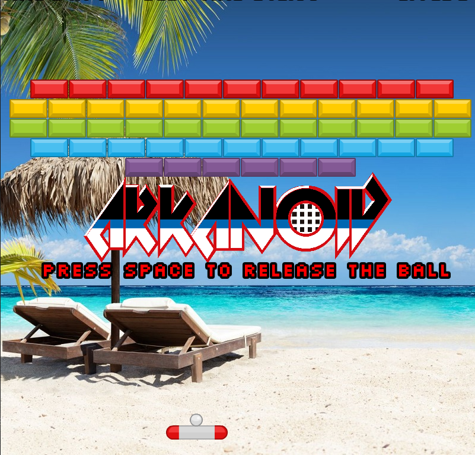
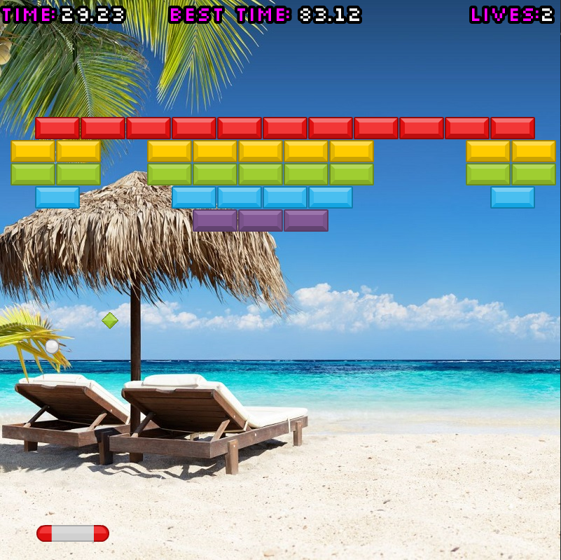
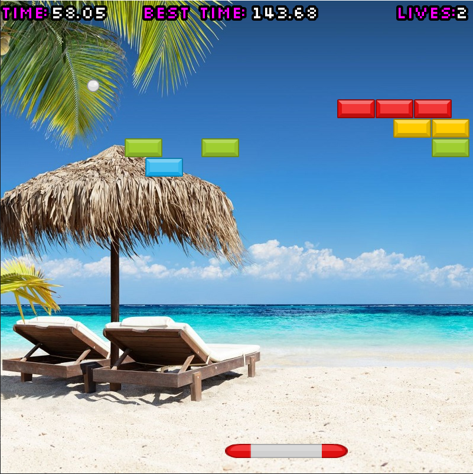
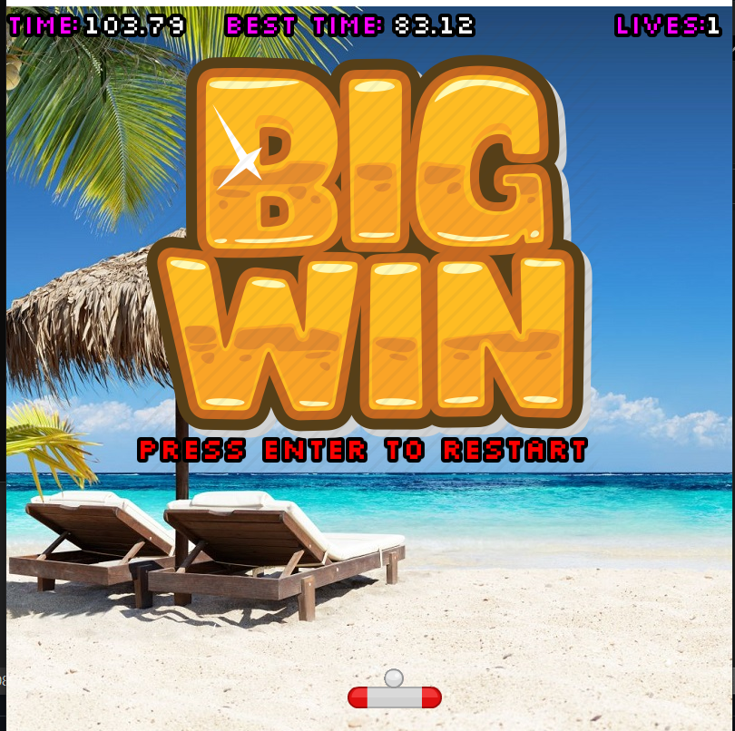
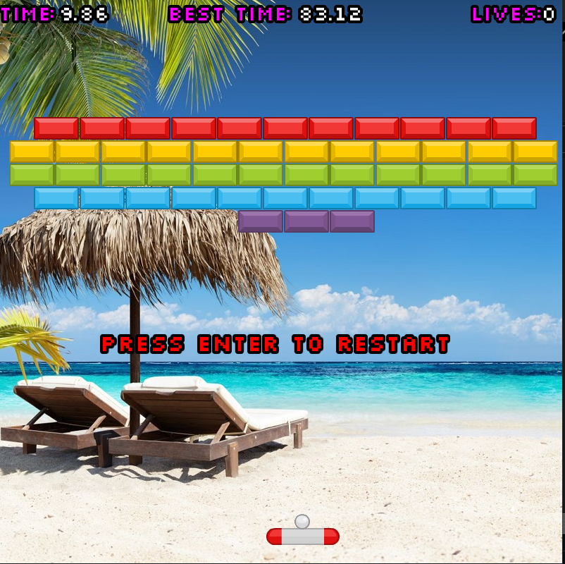

# Arkanoid
C++ OldSchool game that I made on my second semester of studying.

Made in QT Creator. Graphic interface based on SFML (Simple and Fast Multimedia Library)
Rules are simple: after every hit ball goes faster. To win you need to destroy all the blocks. Sometimes after destructing the blocks you can drop power-up which makes your racket wider

After completing the semester I kinda made fun of this project by adding funny music, beach theme, sound effects and power-ups.

# Some gameplay screens:

Starting screen:

  

Dropping power-up:

  

Collecting power-up

  

Win screen:
Dropping power-up:

  

Loose screen:

  

